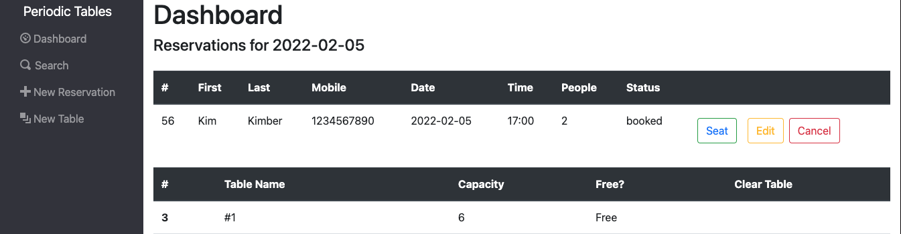
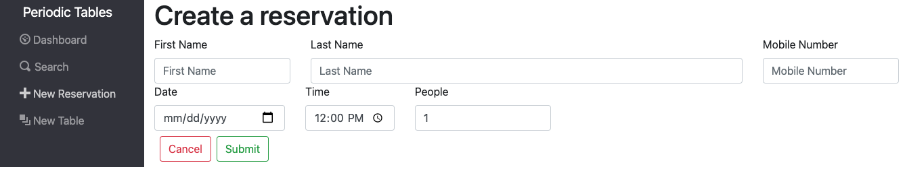
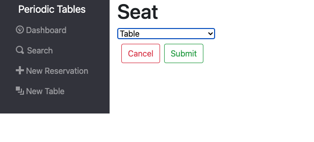
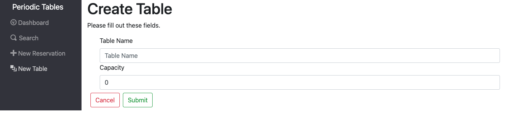

# Periodic Tables Restaurant Reservation Management System

### Final capstone project for Thinkful's software engineering program.

Thank you for looking at my project!

## Link to deployed app
----insert link here-------

## User Guide

Displays all reservations on a given day with navigation buttons to change the date. This is the default page when visiting the app. 

Each reservation that has a status of "booked" will display a button to Seat, as well as buttons to Edit or Cancel the given reservation.

The tables information below displays each table in the restaurant along with its availability status.

Going to the "New Reservations" page in the navigation shows this page:

Adding a new reservation that meets the requirements and clicking Submit will save the reservation and redirect you back to the dashboard page for the reservation made.

Once you're back on the main page, to seat a reservation, click the Seat button next to an eligible reservation, which will bring you to this screen:

Once an eligible table with the required amount of seats has been selected, the party can be seated, and the button is hidden from the dashboard view.

To add a new table, click the "New Table" link on the navigation, and you will see this screen:

As long as the table name is 2+ characters and the capacity is 1 or more, the new table can be created.

## Documentation of the API
The API of the of the app adheres to RESTful conventions.  It has the following endpoints and requires all requests to be in JSON format:

/reservations
This accepts GET and POST requests

GET requests - must contain either a mobile_number or a data query parameter, i.e. /reservations?mobil_number=xxx-xxx-xxxx or /reservations?date=YYYY-MM-DD. It will return an array of reservations matching the search parameters.

POST requests - creates a new reservation, requires a set of fields including first_name, last_name, mobile_number, reservation_date, reservation_time, people, and status.  It will return the new reservation as saved in the database.

/reservations/:reservation_id
This accepts GET and PUT requests

GET requests - returns the singe reservation with the requested id.  No body is needed in the request.

PUT requests - updates the requested reservation, though the request must satisfy the requirements for creating a new reservation including required fields.

/reservations/:reservation_id/status
This accepts PUT requests

PUT requests - updates only the status for a given reservation, as when seated, cancelled, or finished.

/tables
This accepts GET and POST requests

GET requests - provides an array including every table.

POST requests - creates a new table, which requires a table_name and a capacity, which must be an integer.

/tables/:table_id/seat
This accepts PUT and DELETE requests

PUT requests - adds a reservation_id to the table, that indicates which party is seated there.

DELETE requests - removes the reservation_id from the table, and changes the status of the reservation to "finished"

## Technology Used

The front end was built with React 17.0.1 and was styled with Bootstrap 5.

The API was built with Node and Express in JS.

The database is PostgreSQL and hosted by ElephantSQL.

## Installation Instructions
You will need to have Node installed on your machine.  

Run `npm install` in the root directory

In the back-end subfolder, run `npx knex migrate:latest` and `npx knex seed:run` and `npm start`

In the front-end subfolder, run `npm start` 

